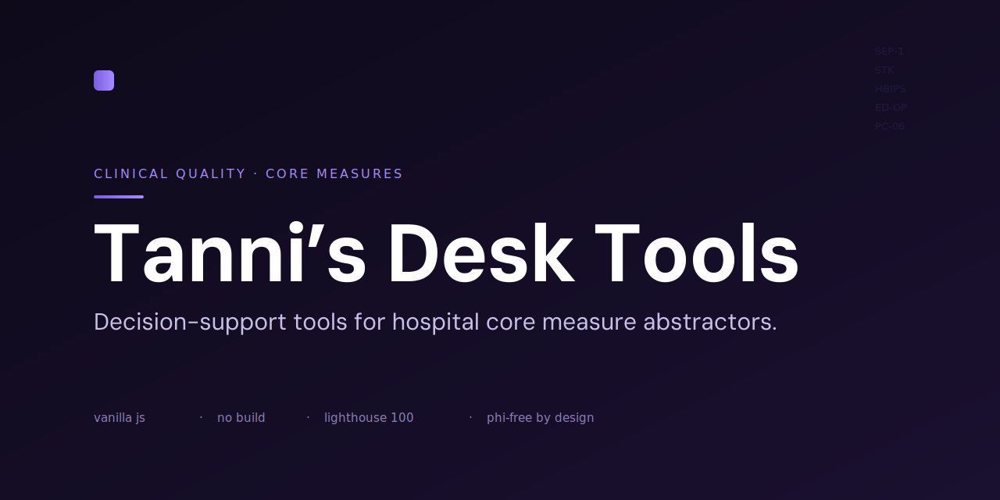

<p align="center">
  
</p>

# Tanni's Desk Tools

A suite of browser-based utilities for TJC/CMS core-measure abstraction — spec tracking, medication sorting, timeline resolution, reporting deadlines, and a few things to keep the workday sane. Everything runs in the browser, no install.

**Live site:** https://tannimon.github.io/tannis-desk-tools/

Open `index.html` — the hub — and launch any tool from there. Each tool is also a standalone, self-contained HTML file.

> Everything runs client-side. Tools that accept pasted or uploaded data (medication lists, fallout trackers) parse it in your browser — no backend, no server, nothing transmitted or stored. Follow your organization's policy before entering real PHI into any browser tool, including this one.

---

## What's inside

**Hub**

| File | |
|---|---|
| `index.html` | Launcher for everything below — sidebar nav, search, and card grid |

**Stay Current**

| File | |
|---|---|
| `spec-tracker.html` | Track TJC/CMS spec releases, compare versions, jump to source manuals |
| `audit-countdown.html` | Quality Reporting Calendar — CMS/TJC submission deadlines by event |

**Analytics**

| File | |
|---|---|
| `fallout-dashboard.html` | System-wide fallout view by site, measure, journey phase, and attribution |

**Abstraction tools**

| File | |
|---|---|
| `Tanni-stk-med-identifier-work.html` | STK Med Identifier — sorts discharge meds into STK-2/3/5/6 categories (Appendix C) |
| `lkw-tool.html` | LKW Resolution Tool — resolves Last Known Well per TJC priority rules |
| `cmo-tool.html` | CMO Abstraction Tool — classifies Comfort Measures Only exclusions |
| `sep1-tool.html` | SEP-1 Tool — auto-detects SIRS, organ dysfunction, bundle elements; suggests Time Zero |
| `hbips-tool.html` | HBIPS Tool — HBIPS-2 through HBIPS-5 abstraction |
| `med-compare-tool.html` | Med Source Comparison — flags discrepancies across medication lists (RxNorm-backed) |

**Utilities**

| File | |
|---|---|
| `timekeeping-calculator.html` | Clock-out calculator |
| `focus-tool.html` | Focus & Sound — Pomodoro timer, ambient audio, and a Sawyer photo break |

**Games**

| File | |
|---|---|
| `abstractly.html` | Wordle-style clinical word game |
| `wordsearch-tool.html` | Word search builder — print or play |
| `audittrail-tool.html` | Match-3 break game |

**Supporting files**

| File | |
|---|---|
| `rx_lookup.js` | RxNorm brand/generic pairs for Med Source Comparison |
| `excluded_terms.js` | Term exclusions |
| `core-measure-elements.json` | Spec-element reference data |
| `a1.mp3`–`a5.mp3` | Original focus tracks (the SEP-1 songs) |
| `*-ambient-*.mp3` | Licensed ambient tracks for Focus & Sound (filenames preserve attribution) |

---

## Running locally

No build step, no install. Clone and open `index.html` in a browser.

```bash
git clone https://github.com/tannimon/tannis-desk-tools.git
cd tannis-desk-tools
```

Each tool is a single self-contained HTML file. Loaded from a CDN at runtime: Phosphor Icons, Google Fonts (DM Sans, DM Mono), SheetJS (spreadsheet parsing), and pdf-lib where needed.

---

## Built by

Tanni — clinical quality abstractor, vibe code hobbyist, and web design enthusiast. She loves her dog, Sawyer.

Chief Morale Officer duties handled by Sawyer, who appears when you least expect him.
